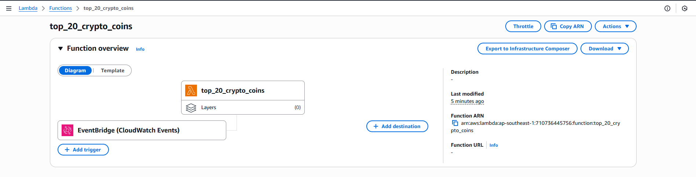
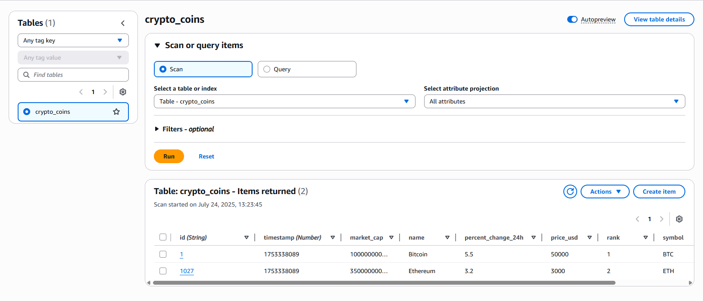

<br>

## Table of Contents
- [Given problem](#given-problem)
- [The structure of the project](#the-structure-of-the-project)
- [How to run the project](#how-to-run-the-project)

   - [Setup API key](#setup-api-key)
   - [Deploy the project](#deploy-the-project)

- [Schema of crypto-coins table](#schema-of-crypto-coins-table)
- [How to run test cases on the local](#how-to-run-test-cases-on-the-local)
- [How to check format code of Terraform files](#how-to-check-format-code-of-terraform-files)
- [Wrapping up](#wrapping-up)


<br>

## Given problem

1. Study terraform and its CLI commands.
2. Create a terraform project that create these resources on AWS provider:

    - IAM role.
    - Lambda
    - Secret
    - S3 resource / DynamoDB

3. Lambda should be able to run by manually trigger & by schedule (every 4 hours) to pull top 20 crytpo coins pricing from CoinMarketCap (using free tier API) and write it to S3/DynamoDB table.
4. CoinMarketCap API creds should be stored in Secrets, and Lambda should be consume API creds from it.
5. All resources should be created/destroyed from Terraform CLI commands (terraform apply, terraform destroy).


<br>

## The structure of the project

```
|--- backend
|
|--- infra
       |
       |--- base-deployment
       |--- dynamodb
       |--- lambda
       |--- secrets-manager
```

1. `backend` directory.

   Write code to satisfy the core flow:
   - Get API Key of CoinMarketCap from AWS Secrets Manager.
   - Pull the top 20 crypto coins from CoinMarketCap.
   - Save them to AWS DynamoDB.

2. `infra` directory.

   This directory contains the Terraform code for AWS services.

   - DynamoDB.
   - Lambda.

      In Lambda, we will configure AWS CloudWatch Event that will be sent to Lamda every 4 hours.

      

   - Secrets Manager.

      |   Secret    |           Description          |
      | ----------- | ------------------------------ |
      | cmc_api_key | The API Key from CoinMarketCap |


<br>

## How to run the project

### Setup API key

1. Register an account on CoinMarketCap and get API Key.

2. Create a file `terraform.tfvars` from file `terraform.tfvars.example`:

   ```bash
   cd infra/base-deployment
   cp terraform.tfvars.example terraform.tfvars
   ```

3. Update API key in the file `terraform.tfvars`:

   ```
   cmc_api_key = "your_actual_api_key_here"
   ```

### Deploy the project

1. Move to the folder `infra/base-deployment`.

   ```bash
   cd infra/base-deployment
   ```

2. Initialize Terraform on this project.

   ```bash
   terraform init
   ```

3. Create `lambda-layer.zip` file.

   - 1st way: Use `create_lambda_layer.py` script file to create `lambda-layer.zip` file.

      ```bash
      cd ..
      cd lambda

      python .\lambda-layer\create_lambda_layer.py
      ```

   - 2nd way: Run `pip install -r requirements.txt -t python/` command or run script file `install_requirements.py` to pull dependencies that are defined in `requirements.txt` file. Then `archive_file lambda_layer_zip` will zip `python/` directory to `lambda-layer.zip` file.

4. Check the resources.

   ```bash
   terraform plan
   ```

5. Deploy resources on AWS.

   ```bash
   terraform apply -auto-approve
   ```

6. Delete all resources on AWS.

   ```bash
   terraform destroy -auto-approve
   ```

<br>

## Schema of crypto-coins table

Below is the schema of the table `crypto_coins`:

```json
{
  "id": "string", // Primary key - ID of a coin on CoinMarketCap
  "timestamp": "number", // Sort key - The time that get data from CoinMarketCap (Unix timestamp)
  "name": "string", // The name of a coin like Bitcoin, Ethereum, ...
  "symbol": "string", // The symbol of a coin like BTC, ETH, ...
  "price_usd": "number", // The price by USD
  "market_cap": "number", // The market cap of a coin
  "volume_24h": "number", // The volume during 24h
  "percent_change_24h": "number", // The percent changes during 24h
  "rank": "number" // The rank of a coin in CoinMarketCap
}
```

When testing Lambda function, the data was saved into DynamoDB.




<br>

## How to run test cases on the local

1. Install the necessary dependencies in the `requirements.txt` file.

   ```bat
   .\scripts\test\install_test_deps.bat
   ```

2. Run Python script for test cases.

   ```bash
   python .\scripts\test\run_tests.py
   ```


<br>

## How to check format code of Terraform files

In the local, we need to run the following command to verify the format of Terraform files in the infra/ directory.

```bash
terraform fmt -check -recursive infra/
```

If any errors happen, run the below command to fix it.

```bash
terraform fmt -recursive infra/
```


<br>

## Wrapping up


